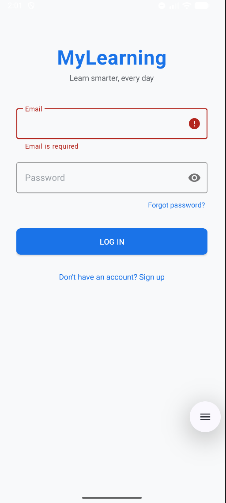
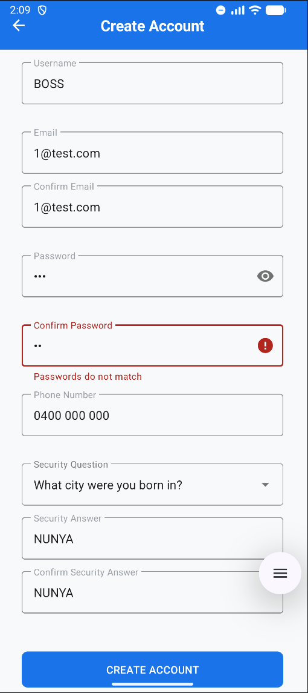
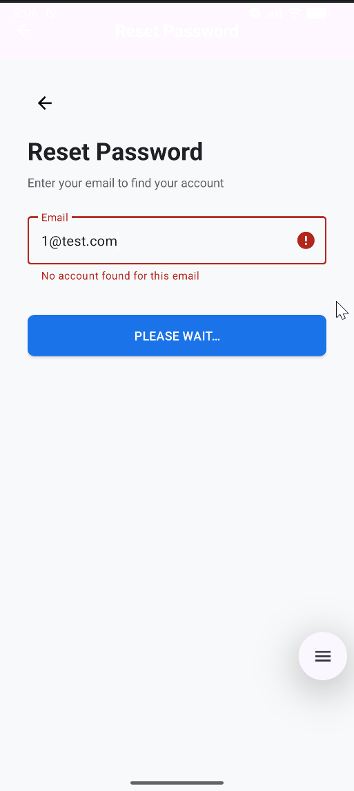
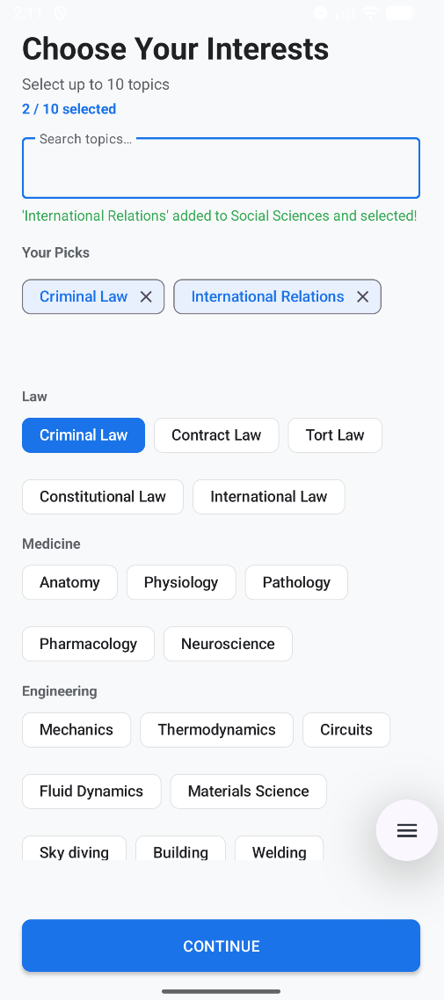
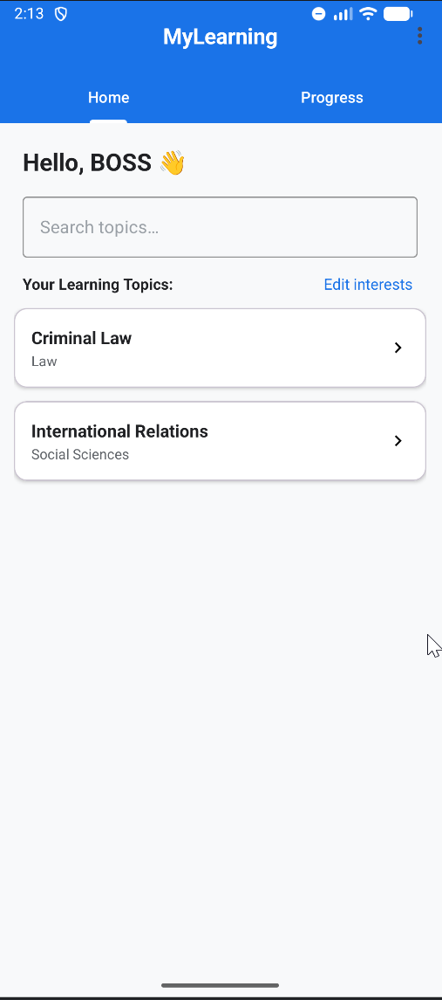
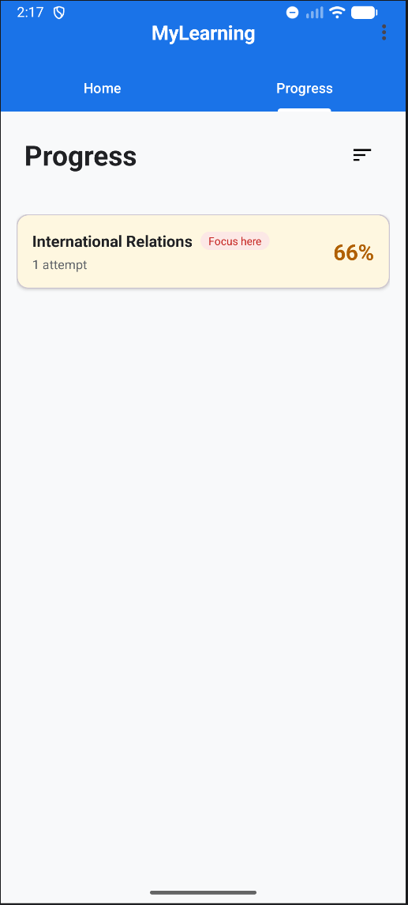
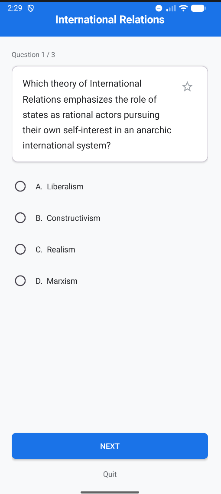
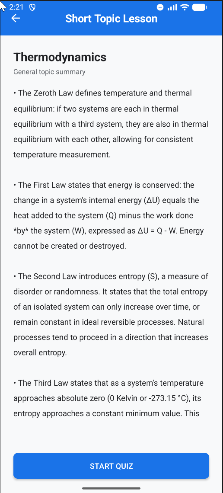
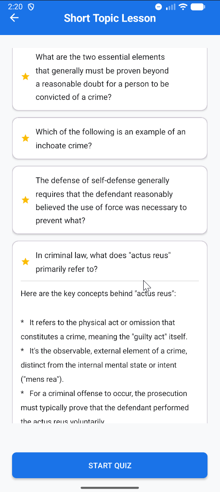
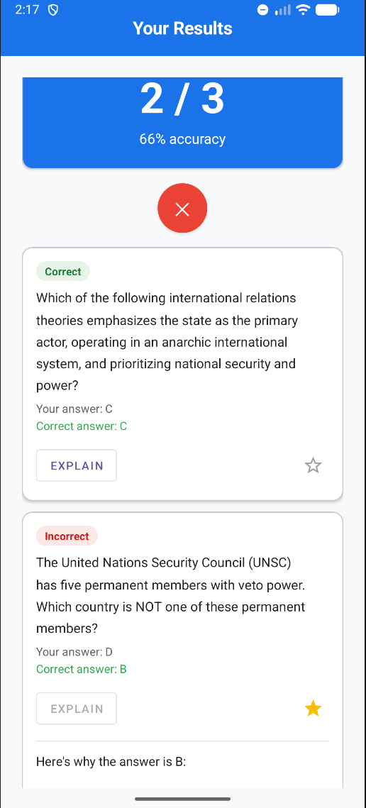

# MyLearning — LLM-Enhanced Learning Assistant

An Android learning assistant app built for **Deakin University SIT305 — Task 6.1D**.  
MyLearning delivers personalised, AI-powered learning experiences through adaptive quizzes, intelligent explanations, and topic-driven study lessons — all generated in real time using the Google Gemini API.

---


## Features

- **Account system** — Register, login, forgot password with security question/answer recovery. Passwords and security answers hashed with SHA-256.
- **Interest selection** — Choose up to 10 topics from a categorised list. Search existing topics or add new ones — validated by Gemini as genuine academic subjects and classified into categories automatically.
- **AI-generated quizzes** — 3 multiple choice questions generated per topic via Gemini. Questions are unique each attempt.
- **Star questions** — Bookmark any question during a quiz to revisit later. Stars persist to Room database immediately.
- **Quit and save** — Quit mid-quiz and all answered questions plus the current selection are saved and counted toward progress.
- **Results screen** — Per-question breakdown showing your answer vs the correct answer. Tap Explain for a 3-bullet AI explanation generated inline with loading and retry states.
- **Short topic lesson** — If you have starred questions, they load as expandable cards with AI explanations. If not, a 5-bullet topic summary is auto-generated on entry.
- **Progress tracking** — Per-topic accuracy and attempt count. History persists even when topics are removed from your interests. Tap any topic to jump straight into a quiz or lesson. Removed topics are re-added automatically (subject to 10 topic limit).
- **Logout** — Clears session and returns to login with back stack wiped.

---

## Screenshots

| | | |
|---|---|---|
|  |  |  |
| **Login** | **Create Account** | **Pw Reset** |
|  |  |  |
| **Subject Select** | **Home** | **Progress** |
|  |  |  |
| **Quiz** | **Initial Short Lesson** | **Targeted Short Lessons** |
|  |  |  |
| **Results** | **Splash** | **App Icon** |

---

## LLM Integration

Two LLM-powered learning utilities are implemented using the **Google Gemini API**:

| Utility | Screen | Trigger |
|---|---|---|
| Answer explanation | Results | User taps Explain on any question |
| Topic summary / starred question explanation | Lesson | Auto on entry (summary) or tap to expand (starred) |

Both utilities display the AI response inline, handle loading states, and provide retry on failure.

An additional LLM utility handles **new topic validation** on the Interests screen — Gemini classifies whether a user-submitted topic is a genuine academic subject before persisting it.

---

## Tech Stack

| Component | Technology |
|---|---|
| Language | Java |
| Min SDK | API 26 |
| Target SDK | API 36 |
| Database | Room (SQLite) |
| Networking | Retrofit 2 + OkHttp |
| AI | Google Gemini API (REST) |
| UI | Material Components 3, ViewBinding |
| Session | SharedPreferences |
| Security | SHA-256 password hashing, API key via BuildConfig |

---

## Project Structure

```
com.example.mylearning/
├── data/
│   ├── dao/          # Room DAOs — UserDao, TopicDao, QuizAttemptDao, QuizQuestionDao
│   ├── entity/       # Room entities — User, Topic, UserTopic, QuizAttempt, QuizQuestion
│   └── AppDatabase   # Singleton Room database, version 2
├── network/
│   ├── GeminiApi     # Retrofit interface — POST to Gemini generateContent endpoint
│   ├── GeminiClient  # Singleton Retrofit client with timeouts, debug-only logging
│   ├── GeminiRequest # Request body model
│   └── GeminiResponse# Response model with safe getResponseText()
├── ui/
│   ├── HomeFragment      # Home tab — topic cards, search, edit interests
│   └── ProgressFragment  # Progress tab — per-topic accuracy, history, re-add topics
├── util/
│   ├── HashUtil      # SHA-256 hashing for passwords and security answers
│   ├── SessionManager# SharedPreferences session — userId and username only
│   ├── ToolbarUtil   # Consistent centered toolbar title and white back arrow
│   └── TopicSeeder   # Pre-populated topic list seeded on first launch
├── ForgotPasswordActivity  # 3-step inline password reset
├── HomeActivity            # Tab host — Home and Progress fragments
├── InterestsActivity       # Topic selection with AI-powered new topic validation
├── LessonActivity          # Starred question explanations or AI topic summary
├── LoginActivity           # Email + password login with SHA-256 verification
├── QuizActivity            # Gemini-generated quiz with star and quit support
├── ResultsActivity         # Score summary + per-question AI explanation
└── SignupActivity          # Registration with security question setup
```

---

## !!! API Key Setup — Required to Run !!!

This app uses the Google Gemini API for quiz generation, answer explanations 
and topic summaries. The API key is not included in the repository and must 
be supplied before running.

1. Get a free key at [aistudio.google.com](https://aistudio.google.com/app/apikey) 
   — no credit card required
2. Create or open `local.properties` in the project root (same level as `app/`)
3. Add this line:
```
GEMINI_API_KEY=your_key_here
```
4. Sync and rebuild the project in Android Studio

**Note for markers:** A fresh API key takes under 60 seconds to generate 
and is free with a Google account. Without it the app will launch but 
AI-powered features will not function.

---

## Running the App

1. Clone the repository
2. Open in Android Studio
3. Add your Gemini API key to `local.properties` as above
4. Run on an emulator or physical device (API 26+)

---

## AI Usage Declaration

This project was developed with AI assistance from **Claude (Anthropic)** for code generation, architecture decisions, and debugging. All AI assistance has been declared in accordance with Deakin University's academic integrity policy.

The app itself integrates the **Google Gemini API** as a declared LLM for learning utilities as required by the task specification.

---

## Security Notes

- Passwords and security answers are hashed with **SHA-256** before storage — plain text is never persisted
- The Gemini API key is stored in `local.properties` and injected via `BuildConfig` — never hardcoded
- HTTP logging is disabled in release builds via `BuildConfig.DEBUG` flag
- All activities except `LoginActivity` are `exported="false"` in the manifest

---

## Legal

This project was created for educational purposes as part of Deakin University's SIT305 unit. All rights reserved. Reuse, redistribution, or reproduction of any part of this codebase requires explicit written permission from the author.

---
